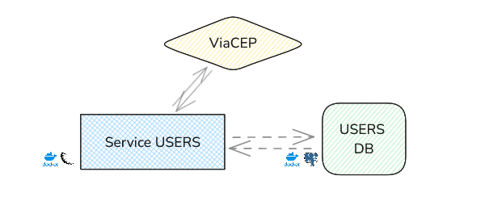

# PUCAPP SERVICE USERS
Gilmar Neves

> ⚠️ **Attention**
>
> Before running any service containers, **ensure the infrastructure services (e.g., database, network) are up and running**.
> Failing to do so may result in connection errors or failed startup for dependent services.
> 
> > 🔗 The infrastructure service can be found [**here**](https://github.com/nevesgil/pucapp_infra).


## Summary

- [Introduction](#introduction)
- [Tech and Tools](#tech-and-tools)
- [Architecture](#architecture)
     - [Database Model](#database-model)
- [Use](#use)
    - [Endpoints](#endpoints)

### Introduction

PucappService is a MVP for evaluating the capabilities of Microservices in an app that serves the purpose of being a shopping service coupled with an users registering service.

The USERS SERVICE provides a Flask API (Python) for interacting with users and their addresses either via registering, updating, retrieving and deleting those using HTTP methods in a REST API.

The API is exposed in port 5001.

The data is stored in PostgreSQL databases.
In order to connect the API with the database servives, we need them to run in the same network.

The Addresses part of the service uses an external API ViaCEP (https://viacep.com.br/) for retrieving addresses from a ZIP Code (CEP).


### Tech and Tools
  


This API runs in the network created in the infrastructure service.
The service is built in Flask using other Python libraries such as Marshmallow for creating and validating schemas and SQLAlchemy for ORM.

It also consumes data from the external API ViaCEP.


The storage runs in another service and is accessed on port 5432 (PostgreSQL).

### Architecture

The containers we have run on the same docker network and, thus, can communicate to each other in a easily manner.
The ViaCEP API is external and hosted as a public service.



```
> USERS

GET /user/{user_id}
PUT /user/{user_id}
DELETE /user/{user_id}
GET /user
POST /user

> ADDRESSES

GET /address/{address_id}
PUT /address/{address_id}
DELETE /address/{address_id}
GET /address/lookup/{zip_code}
GET /address
POST /address
```

#### Database Model

In the database users_db, one may find the normalized model:


### Use

In order to use this for running the project, please follow the steps described below:

i) Clone the repository into your machine as:

```
git clone https://github.com/nevesgil/pucapp_service_users.git
```

ii) Run the docker compose file

Having the Docker up and running on your machine, you may simply run the command below to have the services running:

```
docker compose up -d --build
```

Obs:
When not using the service anymore, run:
```
docker compose down
```

iii) Access the service on https://localhost:5001


#### Endpoints

##### Users


##### Addresses

